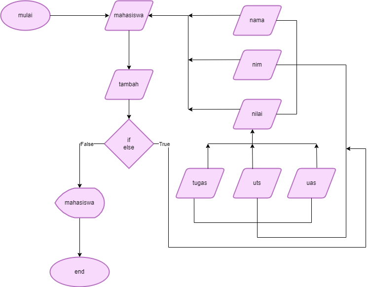

# **program sederhana untuk menambahkan data kedalam sebuah list**
  

### **MY SOSIAL MEDIA :**

         

- **penjelasan**
   

1. deklaras list mahasiswa untuk menampung nama, nim, nilai.
2. deklarasi nomor urut untuk menentukan data ke berapa
3. gunakan pengulangan while dan isi inputan nama, nim, nilai
4. deklarasi list nilai untuk menampung nilai_tugas , nilai_uts, nilai_uas.
5. masukan nilai_tugas ke list nilai[0]
6. masukan nilai_uts ke list nilai[1]
7. masukan nilai_uas ke list nilai[2]
8. jumlahkan dan bagi 3, untuk tugas 3.5 untuk uts, 3.5 untuk uas.
9. deklarasi variable tambah untuk menampung string dan type data dari semua nama, nim, nilai.
10. gunakan stament if verify yang di isikan string "y" untuk memverifikasi tambah data, men increment variable no dan menlooping perogram.
11. ketika user menginput string "n" akan masuk ke statment else yang berisikan print.
12. di dalam statment else gunakan for data di dalam mahasiswa untuk menlooping data di variable tambah.

## **Flowchart**

